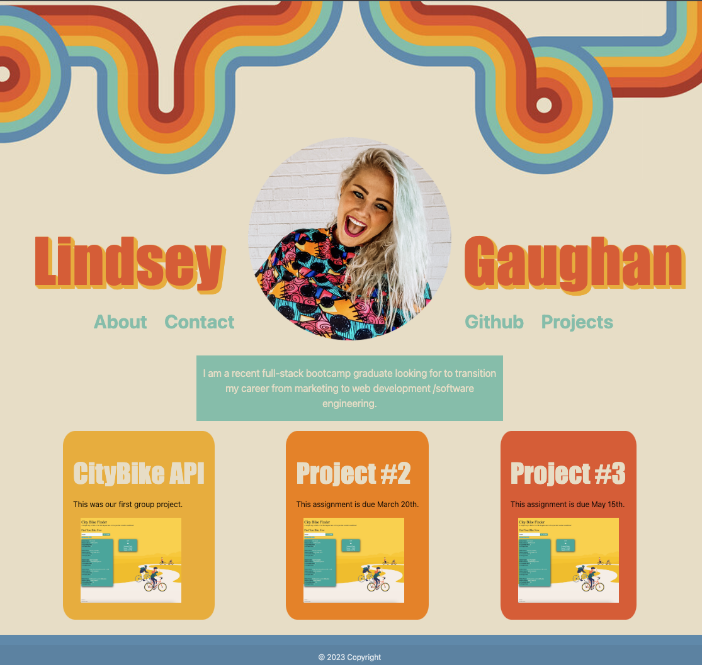

# Gaughanln-Portfolio 💁🏼‍♀️

## Description

I've created my first portfolio using HTML & CSS. Per the requirements of the assignment, you'll find the following:

* Sample Work
* Photo of myself + about me
* Links to text within the site
* Contact information
* A responsive layout

### End Product 
Below is a screenshot of what my portfolio looks like.

## Deployment

Here is the [link](https://gaughanln.github.io/Gaughanln-Portfolio/#project1) to the live website

## Contributing
Lindsey Gaughan (Me!)

